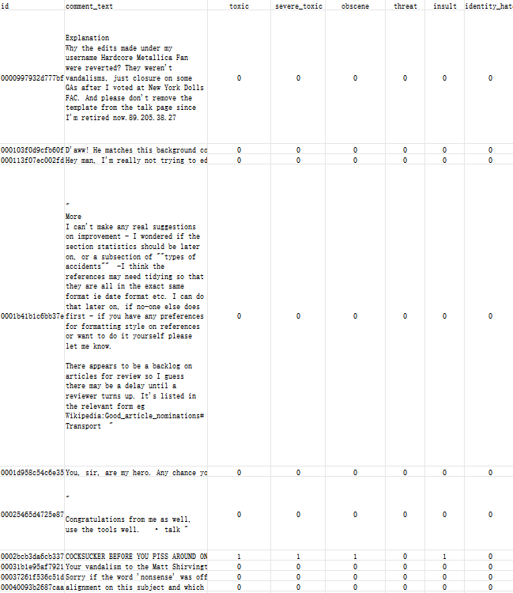
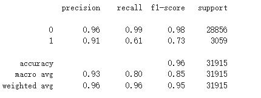
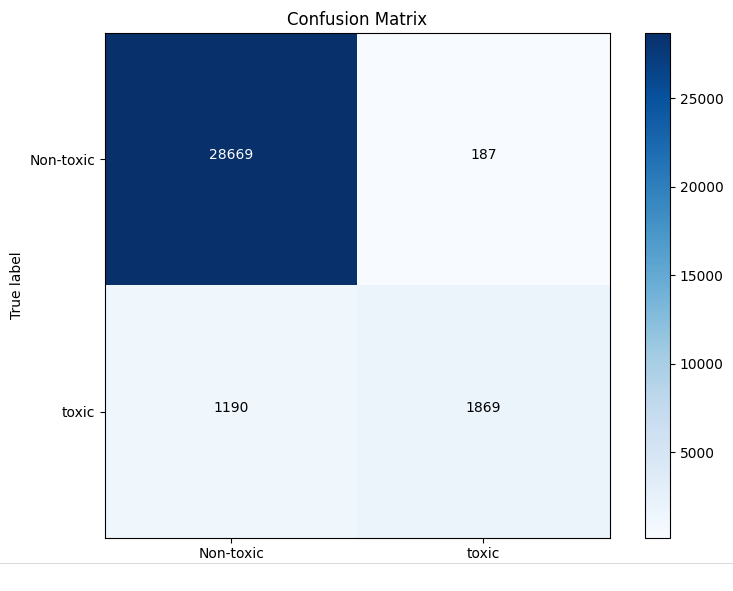
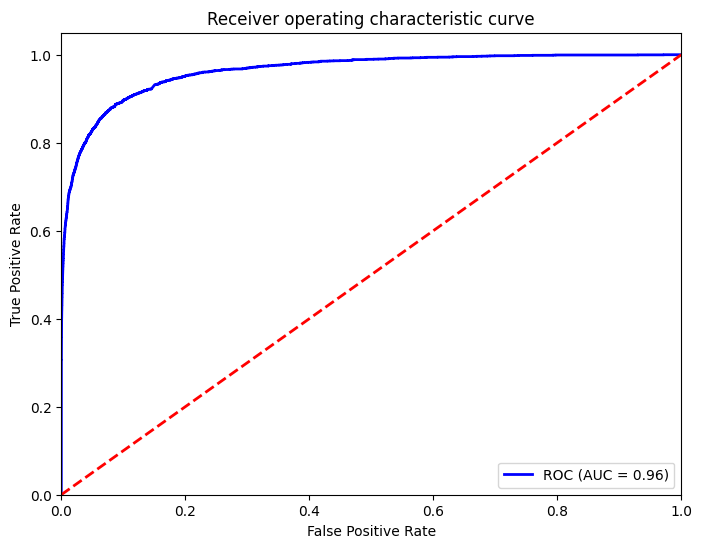
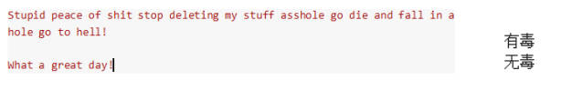

Using natural language processing, using machine learning models (such as logistic regression, support vector machine, deep learning model) to classify text, identify inappropriate content (such as hate speech, harassment, pornography, etc.), analyze the sentiment tendency of the text, and identify possible negative emotions or offensive language.
1. Solution architecture
   
1.1 Data collection
Data source: 

Use public datasets on the Internet or collect user-generated content from social platforms (such as Twitter, Facebook, Weibo, etc.), including posts, comments, private messages, etc.
Data annotation: Work with the manual review team to annotate illegal content (such as hate speech, harassment, false information, etc.) and compliant content in the dataset to establish a training dataset.

  

Table1：data set
   
A public malicious comment dataset was downloaded from the Kaggle official website, totaling about 160,000 data points for training.

1.2 Data preprocessing

Text cleaning: 

remove irrelevant characters, HTML tags, URLs, emoticons, etc.

Word segmentation: perform word segmentation on the text, especially for languages ​​such as Chinese, use appropriate word segmentation tools.

Remove stop words: remove common stop words to reduce noise.
Word embedding: use word embedding technology to convert text into vector representation.

1.3 Feature Engineering

Text features: Extract text features, such as TF-IDF (term frequency-inverse document frequency), sentiment analysis score, sentence length, etc.

Contextual features: Consider the contextual information of the text, such as the user's historical behavior, social network characteristics, etc.

1.4 Model selection
Traditional machine learning model: using logistic regression for classification.

1.5 Model training and evaluation
Training set and test set division: divide the labeled data set into training set and test set, using 80% for training and 20% for testing.

Hyperparameter tuning: use cross-validation and other methods to optimize the model's hyperparameters (such as learning rate, batch size, etc.).

Model evaluation: use accuracy, recall, F1-score and other indicators to evaluate model performance.

  

  

Overall Accuracy:
The overall accuracy of the model is 96%, which indicates that the model performs very well on the test set and most samples are correctly classified.

Performance of Class 0:

Precision: 0.96

This means that 96% of all samples predicted as Class 0 are actually Class 0, and the model's predictions on this class are very reliable.

Recall: 0.99

This means that 99% of all samples that are actually Class 0 are correctly predicted as Class 0, and the model almost never misses this class.

F1-score: 0.98

The high F1-score indicates that the model performs very well on Class 0.

Performance of Class 1:

Precision: 0.91

91% of all samples predicted as Class 1 are actually Class 1, and the model's predictions on this class are also relatively reliable.

Recall: 0.61

This means that among all samples that are actually class 1, only 61% are correctly predicted as class 1, and the model has a high rate of missed detection on this class.

F1-score: 0.73

The low F1-score indicates that the overall performance of the model on class 1 is not as good as class 0, and there is room for improvement.

Macro Avg:

Precision: 0.93

Recall: 0.80

F1-score: 0.85

The macro average shows that the model performs evenly on different classes, and the recall is relatively low, indicating that the recognition ability of class 1 is insufficient.

Weighted Avg:

Precision: 0.96

Recall: 0.96

F1-score: 0.95

The weighted average takes into account the amount of support for each class, indicating that the model performs very strongly overall.

  

  ROC curve

The ROC curve is close to the upper left corner, and AUC = 0.96, which is an excellent model that can distinguish positive and negative samples well.

  

